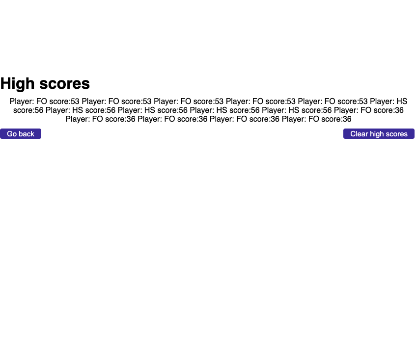

# code-quiz

## Description
This repository contains HTML, JavaScript, and CSS files that work together to make a coding quiz. The coding quiz takes the user through a series of five code related questions. The quiz is timed and the faster the user ompletes the quiz, the higher the score they get. Additionally, if a user answers a question incorrectly, five seconds is deducted from their time. Once the user has reached the end of the quiz, or the timer gets to 0, the user is prompted to enter in their initals to have their score posted on the highscores page. Here the user can view or clear the highscores. The HTML and CSS files are updated dynamically and are powered by JavaScript. This quiz is perfect for any new developer that wants to test their coding knowledge!

## Images of the site

.png)
%20copy.png)
%20copy%202.png)

## Link to Deployed Site

## Acknowledgments

* Xpert, the AI Learning Assistant from EdX and my tutor Matthew Calimbas were both incredibly helpful in finding errors in my code and helping me to correct them

